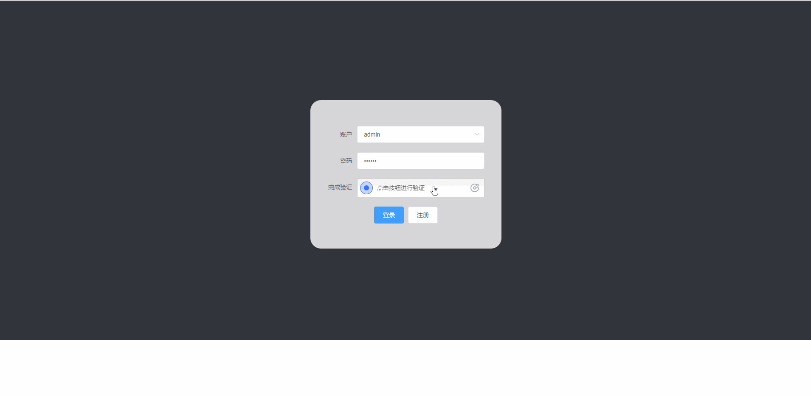

# File Upload
集成了`文件上传`, `远程评分`, `用户管理/登录验证`, `文件管理`的前后台结合的文件上传系统。


## 1. 项目演示
### 用户注册


### 用户功能演示


### 管理员功能演示


## 2. 项目安装
```
npm install
```

### 编译及热更新
```
npm run serve
```

### 构建静态项目
```
npm run build
```


### 更多设置请参阅
See [Configuration Reference](https://cli.vuejs.org/config/).
